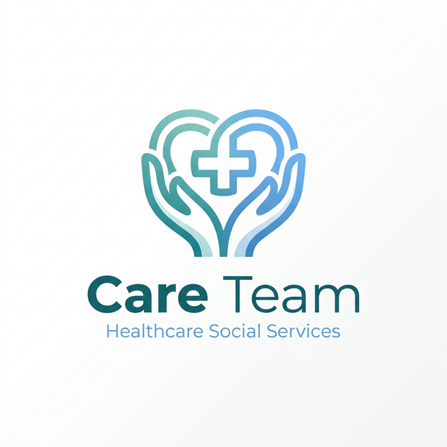
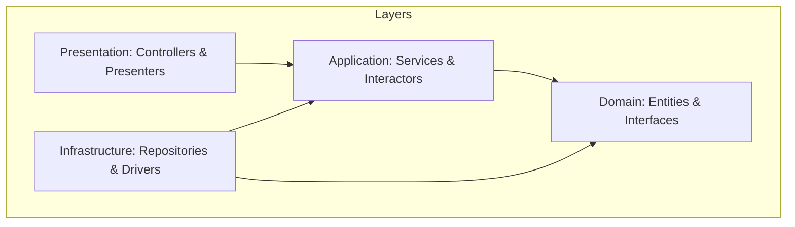

<p align="center">
  
</p>

<h1 align="center">Care Team Songkhla</h1>

<p align="center">
  <strong>Empowering Healthcare Social Services through Technology</strong>
</p>

<p align="center">
  
  
  
  
  
</p>

---

## 🌟 Overview

**Care Team Songkhla** is a robust, full-stack web application designed to streamline healthcare social services. Built with a focus on scalability, maintainability, and user experience, it serves as a central hub for managing care registrations, user profiles, and administrative workflows in the Songkhla region.

## 🏗 Architecture

The project follows the **Clean Architecture** principles to ensure that the core business logic is independent of external frameworks and delivery mechanisms.



### Key Components:
- **Domain**: Pure business logic and entity definitions.
- **Application**: Use cases and service orchestrators.
- **Infrastructure**: Database access (Drizzle), API integrations, and external services.
- **Presentation**: Next.js App Router, React Components, and View Models.

## 🚀 Teck Stack

- **Framework**: [Next.js 16](https://nextjs.org/) (App Router)
- **Styling**: [Tailwind CSS 4](https://tailwindcss.com/) & [Framer Motion](https://www.framer.com/motion/)
- **Database**: [Turso](https://turso.tech/) (libSQL) with [Drizzle ORM](https://orm.drizzle.team/)
- **State Management**: [Zustand](https://zustand-demo.pmnd.rs/)
- **Authentication**: Custom Session-based Auth with [Jose](https://github.com/panva/jose)
- **Animations**: [React Spring](https://www.react-spring.dev/)

## 🚦 Getting Started

### Prerequisites

- Node.js (Latest LTS)
- Yarn or npm

### Installation

1.  **Clone the repository**:
    ```bash
    git clone https://github.com/your-username/care-team-nextjs.git
    cd care-team-nextjs
    ```

2.  **Install dependencies**:
    ```bash
    yarn install
    ```

3.  **Setup Environment Variables**:
    Copy `.env.example` to `.env.local` and fill in the required values.
    ```bash
    cp .env.example .env.local
    ```

4.  **Database Migration & Seeding**:
    ```bash
    yarn db:push
    yarn db:setup
    ```

5.  **Run Development Server**:
    ```bash
    yarn dev
    ```

Open [http://localhost:3000](http://localhost:3000) to view the application.

## 📂 Project Structure

```text
├── app/                  # Next.js App Router (Routing & Pages)
├── src/
│   ├── application/     # Use Cases & Service Interfaces
│   ├── domain/          # Entities & Core Logic
│   ├── infrastructure/  # DB, Repositories, External APIs
│   └── presentation/    # React Components, Hooks, ViewModels
├── public/               # Static Assets
└── drizzle/              # Database Schema & Migrations
```

## 🛠 Available Scripts

- `yarn dev`: Launch the development server.
- `yarn build`: Create an optimized production build.
- `yarn lint`: Run ESLint for code quality checks.
- `yarn db:studio`: Open Drizzle Studio to explore your database.
- `yarn db:push`: Synchronize your Drizzle schema with the database.

---

<p align="center">
  Built with ❤️ for the Songkhla Community.
</p>
